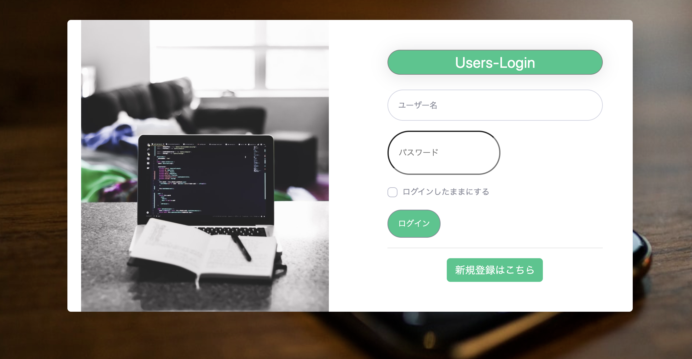
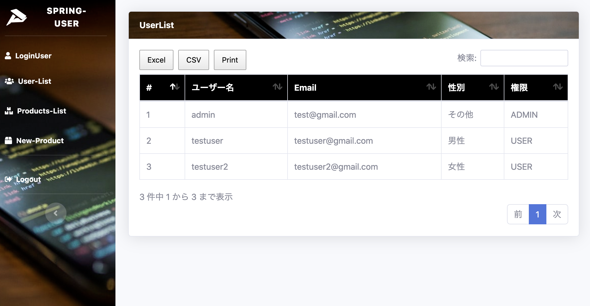
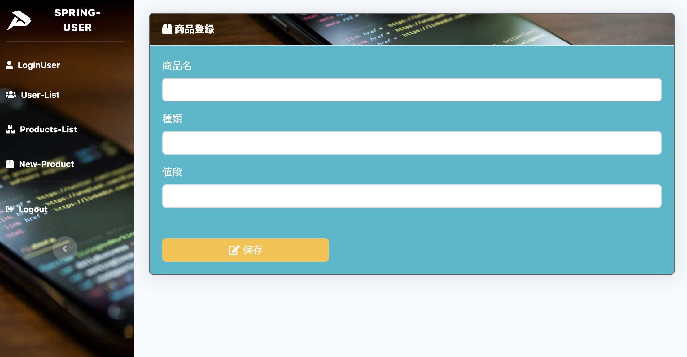
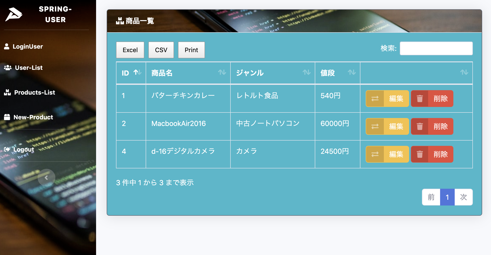

# spring-user

### 開発環境
- Spring Boot 2.3.3
- Java version 14

- Boot strap

### 依存関係
- Spring Boot DevTools
- Lombok
- 検証
- Spring Data Jpa
- H2 Database
- Thymeleaf
- Spring Web
- Spring Security

http://localhost:8080/
ターミナル: ./mvnw spring-boot:run
- ユーザーログイン機能

==============================

- User-List(adminのみ)

==============================

==============================
